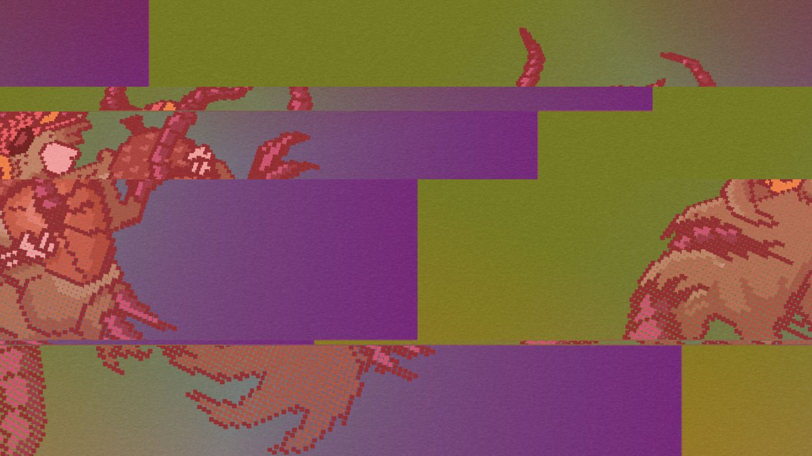

# REJFPANK VISUALS

## Introduction
This is my undergraduate thesis at [FIT CTU](https://www.fit.cvut.cz/en). It visualises MIDI data from incoming stream sourced from samplers, drum machines, gameboys etc.

__The first public performance using this system was on 9. 5. in Prague and it was also [recorded](https://youtu.be/HzFjP2zBFHc).__

I am a big fan of what I call _glitch aesthetics_, commonly seen in the context of the chiptune or algorave scenes. It consists of bright colors, glitches and general randomness. Expect this kind of visual turn-on.

The rest of the readme is mostly for myself. 

## TODO
- revise lighting model, make lights changeable for each song
- setup setlist on app star
- completely rework trigger times (use std::map?)
- revise count/n variables and constant
- make multipass banner standalone object
- add support for any axes in CCamera::placeOnCircle()
- replace CCamera::flow()

## Ideas
- create an algorithm to tessellate a rectangle
	+ parameter (starting from 1) is the 'tessellation lvl' -> cell count equals 1 / (tessellation lvl + 1)^2
- Voronoi diagram with taxicab geometry
- Fog color depending on the y coordinate
- Switch dynamically between ortographic and perspective projection
- Toy with glm::frustum
- Create light emiting objects via fog
- Generate random points and draw tham as triangle strip 
- change directional light on beat
- trailing objects in fifo
- switch to Uniform Buffer Object
- multipass postproduction FX
	+ DES encryption
	+ diffusion
- module based visuals
- think about better containers than arrays
- use raytracing
!
## Known Issues
- When resizing window, objects keep their sizes. Also while resizing, aspect ratio specific items might bring up issues
- point light attenuation not behaving correctly
- minor memory leaks

## Useful links
- [Procedural textures inspiration](http://www.upvector.com/?section=Tutorials&subsection=Intro%20to%20Procedural%20Textures)
- [OpenGL 4.4 blend modes](http://www.slideshare.net/Mark_Kilgard/blend-modes-for-opengl)
- [Imaging algorithms inspiration](http://www.tannerhelland.com/programming-directory/)

## Similar stuff
- [Chrome Visuals](https://github.com/zeroerrequattro/chrome-visuals) — very similar project done in chrome

## Thanks
- Thanks to [Floris 'floriuszzz' Smit](http://www.tf3dm.com/3d-model/lego-all-sizes-colors-94903.html) whose Lego Brick 3D models I'm using
- Thanks to [Gurkan Te](http://www.shroomarts.blogspot.cz) for the squirrel illustrations. As they are not publicly licensed, they are not part of this repository, sorry.